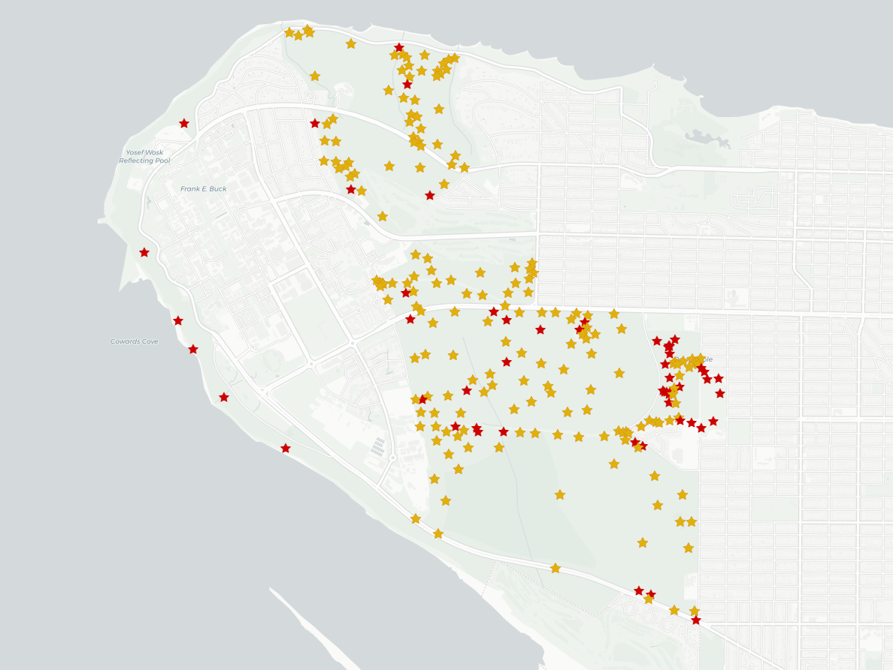

# mapMatcher
I love Pacific Spirit Park in Vancouver. I want to create a tool that gets me into the park as much as possible. The idea is that this app will tell me the portion of trails that I need to run in order to complete an entire lap of the park. Not sure if it will be a cmd line or a simple Python GUI. Main purpose is to make an easy to use tool that will get me outside and work on a fun GIS-esque project. 

# Example Map
### Gold Stars have been collected, Red Stars have not

# Current State

Right now, I can read the Strava data from Sarah and I to collect stars throughout PSP using tests.py and running test_7() in main. This means that the true function of the app works, if you record an activity that crosses a star, the program will recognize and display a different star on your map. 

The part that I want to do that will substantially increase the usefulness of this program is to embed it in a web app. It would be great if a user was redirected to the strava login page, clicks the authorization, waited for the map to be made, and that was it. 

But right now, I have to send a person an authorization link, have them save the authorization_code so that I can send a POST request to retrieve a refresh_token with activity:read_all permissions. I also need them to give me their athlete_id. I believe that if you can automate the authorization_code retrieval with the help of redirect urls, then you can display all the data nicely. 

In order to make it a web app though, the spaghetti code would have to be mended. I don't have enough time to do this now, but if I do decide to continue this forward, it's a must. 

# TODOS

I can manually retrieve a persons authorization code using 

## Finding Strava Credentials

athlete_id 

* Go to strava.com and navigate to 'My Profile' page.
* the 'athlete_id' is embedded in the URL of the webpage, it will look like this 

strava.com/athletes/{MY_ATHLETE_ID}

# Enter this url into browser,

https://www.strava.com/oauth/authorize?client_id=56934&redirect_uri=http%3A%2F%2Flocalhost&response_type=code&approval_prompt=auto&scope=activity:read_all

# the return code will be used in the post request to get the correct refresh token

# in the same return as the refresh token, take the athlete id to use for getting gpx data

# BOOM now deploy the analysis!!!
